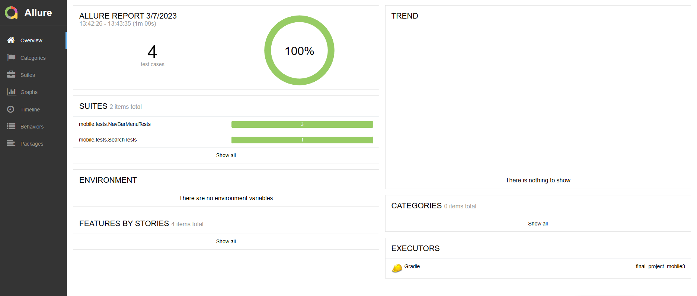
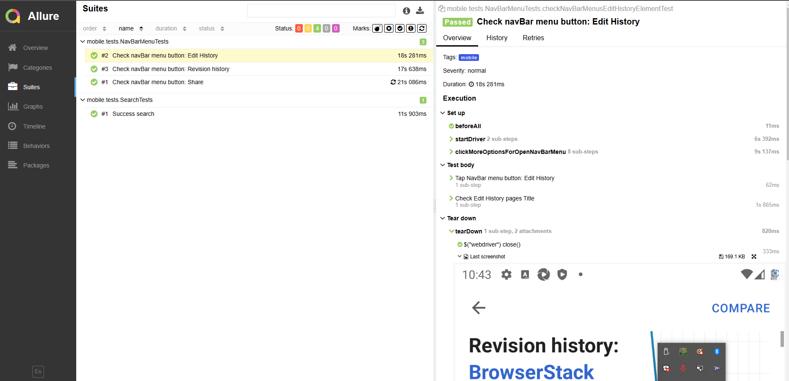
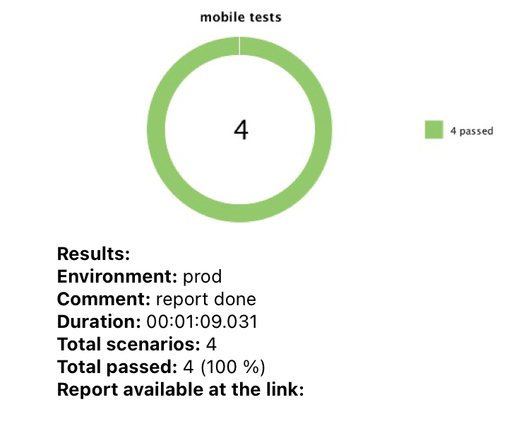

## Проект по автоматизации тестирования (mobile)

## :maple_leaf: Содержание:

- Технологии и инструменты
- Список проверок, реализованных в тестах
- Запуск тестов (сборка в Jenkins)
- Allure-отчет
- Интеграция с Allure TestOps
- Интеграция с Atlassian Jira
- Уведомление в Telegram о результатах прогона тестов
- Видео пример прохождения тестов

## :maple_leaf: Технологии и инструменты

## :maple_leaf: Список проверок, реализованных в автотестах

- [x] Проверка элементов навигационного меню

## :maple_leaf: Запуск тестов

###  Локальный запуск на эмуляторе:
1. Запуск с командной строки: gradle clean test -DdeviceHost=mobile
2. Получение отчёта: gradle allureServe

###  Настройка Jenkins и удаленный запуск в Browserstack:
1. Открыть <a target="_blank" href="https://jenkins.autotests.cloud/job/C16-NazilyaMullagildina_mobile-tests/">проект</a>

2. Выбрать пункт **Собрать с параметрами**
3. В поля LOGIN и PASSWORD ввести BROWSERSTACK_USERNAME и BROWSERSTACK_ACCESS_KEY
4. Нажать **Собрать**
5. Результат запуска сборки можно посмотреть в отчёте Allure

## </a> Отчет в <a target="_blank" href="https://jenkins.autotests.cloud/job/C16-NazilyaMullagildina_mobile-tests/10/allure/">Allure report</a>

###  Главное окно

###  Тесты

###  Графики

## </a> Интеграция с <a target="_blank" href="https://allure.autotests.cloud/project/1893/dashboards">Allure TestOps</a>

### Dashboard с результатами тестирования

### Пример отчёта выполнения одного из автотестов

### Настроен запуск из Allure TestOps выборочных тест-кейсов

### Формируется Launch, происходит автоматический запуск в Jenkins только отмеченных тест-кейсов

## </a> Интеграция с <a target="_blank" href="https://jira.autotests.cloud/browse/HOMEWORK-541">Atlassian Jira</a>

## </a> Уведомление в Telegram о результатах прогона тестов

## </a> Пример видео прохождения теста в Browserstack

[Вернуться к оглавлению ⬆](#Ссылка)
