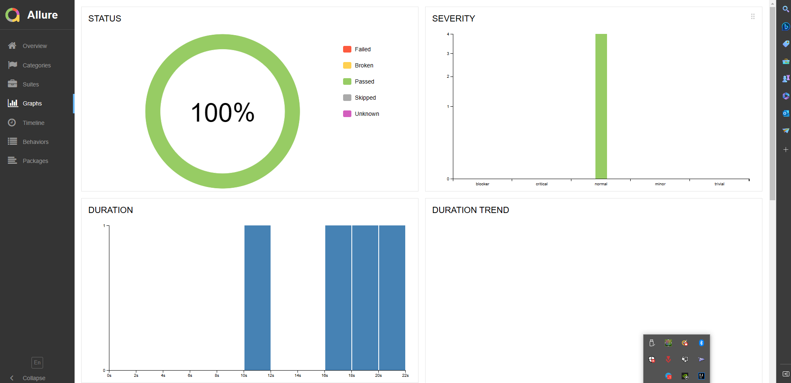

# Дипломный проект по тестирования мобильного приложения [Wikipedia](https://github.com/dkolesnikova/final_project_mobile)

## :maple_leaf: Содержание:

- Технологии и инструменты
- Список проверок, реализованных в тестах
- Запуск тестов 
- Allure-отчет
- Уведомление в Telegram о результатах прогона тестов

## :maple_leaf: Технологии и инструменты

## :maple_leaf: Список проверок, реализованных в автотестах

- [x] Проверка элементов навигационного меню

## :maple_leaf: Запуск тестов

###  Локальный запуск на эмуляторе:
1. Запуск с командной строки: gradle clean test -DdeviceHost=mobile
2. Получение отчёта: gradle allureServe

## </a> Отчет в <a target="_blank" >Allure report</a>

###  Главное окно

###  Тесты

###  Графики

## </a> Уведомление в Telegram о результатах прогона тестов

[Вернуться к оглавлению ⬆](#Ссылка)
